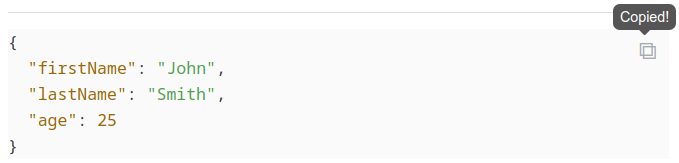

# Joplin plugin code-clipboard

Copy the content of a code block to the clipboard.

## Installation

1. Clone this repo
2. Inside the directory execute `npm run dist`
3. Open Joplin
4. Go to `Tools > Options > Plugins`
5. Click the gear icon next to "Manage your plugins"
6. Choose "install from file"
7. Select the `.jpl` file from `<path-to-repo>/publish`
8. Restart Joplin